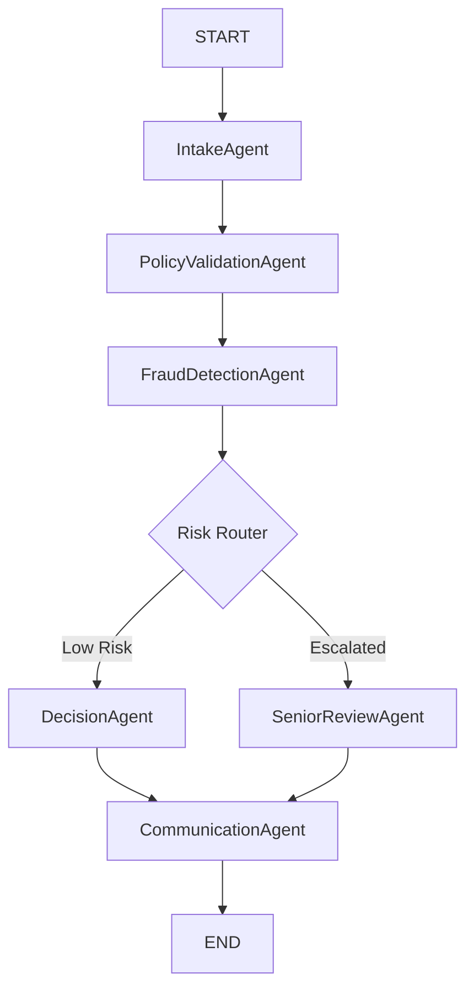

# Multi-Agent Insurance Claims Processing System

A LangGraph pipeline of 6 specialized AI agents that process insurance claims through intake, policy validation, fraud detection, routing, decision-making, and customer communication.

Powered by **LangGraph** and **Grok (xAI)**, with deterministic rule-based fallbacks for fully offline operation.

## Architecture



## Features

- **Multi-Agent Pipeline**: 6 distinct agents sharing a typed state.
- **LLM-Powered Data Extraction**: Converts unstructured claims text into structured JSON.
- **Mock Policy Database**: Simulates backend system validation.
- **Smart Fraud Detection**: Analyzes urgency language, mismatched dates, and limits.
- **Interactive UI**: A sleek Streamlit application to visualize the agent processing trace and output.

## Setup for Streamlit Deployment

1. Clone the repository
2. Install dependencies:
   ```bash
   pip install -r requirements.txt
   ```
3. Set your API Key in Streamlit Community Cloud:
   - Go to App Settings -> Secrets
   - Add `XAI_API_KEY="your_api_key_here"`
   
4. Run locally:
   ```bash
   streamlit run app.py
   ```

*(Note: The `.env` file is intentionally excluded from Git via `.gitignore` to keep your API keys secure. Ensure you add it as a secret in your hosting environment!)*
